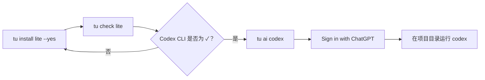

# AI 开发环境初始化

`ai-dev-env-init` 是 `tu-devkit` 中的 AI 开发环境初始化工具集，基于 Bash，面向 macOS 和 Ubuntu WSL2，帮助快速搭建可复用的 AI 全栈开发环境。

仓库级工具索引见 [tu-devkit README](../README.md)。

> 第一次接触本模块，建议先看 [整体导览：阅读顺序、使用主流程与命令内部流向](docs/overview.md)。

## 快速开始

### 先完成前置环境

首次使用按平台依次阅读所需文档：

- Windows + Ubuntu WSL2：先完成 [WSL2 与 Ubuntu 环境](docs/windows-wsl2-setup.md)，再完成 [开发工具前置环境](docs/development-tools-prerequisites.md)。
- macOS：直接完成 [开发工具前置环境](docs/development-tools-prerequisites.md)。

开发工具前置环境包含 Git、GitHub SSH 公钥登记、首次 GitHub 主机指纹确认、Docker Desktop、VS Code Remote - WSL 及 `tu` 安装顺序。其中 GitHub 网页添加 SSH 公钥和账号登录必须由用户参与完成。

### 安装 AI 开发环境初始化模块

> [!IMPORTANT]
> SSH 克隆、`tu init` 和账号登录都可能进入交互状态。不要将下面整段命令一次性粘贴到终端；每次执行一行，看到输出完成或交互结束后再执行下一行。首次 SSH 克隆出现 `Are you sure you want to continue connecting` 时，先核对 [GitHub 官方指纹](https://docs.github.com/authentication/keeping-your-account-and-data-secure/githubs-ssh-key-fingerprints)，确认匹配后输入 `yes` 并等待克隆完成。

```bash
git clone git@github.com:cnxutu/tu-devkit.git
cd tu-devkit
git switch dev
git branch --set-upstream-to=origin/dev dev
git pull --ff-only
cd ai-dev-env-init
chmod +x install.sh
./install.sh
export PATH="$HOME/.local/bin:$PATH"
tu init
tu check lite
```

安装脚本会把完整运行包放到 `~/.local/share/tu-devkit`，并把 `tu` wrapper 放到 `~/.local/bin`；当前 PATH 中存在可写目录时还会同步放置 wrapper，因此 macOS Homebrew 环境通常无需重新打开终端即可执行。工具会自动识别 Homebrew 或 apt，已安装的命令会跳过；安装系统包或运行官方安装器前会请求确认。如果当前没有可写的 PATH 目录，安装器会提示执行 `source ~/.zshrc` 或 `source ~/.bashrc`。

> [!IMPORTANT]
> `git pull` 更新的是仓库工作区；`tu` 实际运行的是安装在 `~/.local/share/tu-devkit` 的副本。每次拉取包含 `ai-dev-env-init` 变更后，请在该目录重新运行一次 `./install.sh`，再执行 `tu check <profile>`。否则会继续运行旧版本，并可能出现 `Unknown module/profile: lite`。

运行 `tu install lite|standard|ultimate --yes` 时，NVM 和 AI 官方安装器的下载会显示阶段与进度，并设置 60 秒连接超时、300 秒总超时和重试。`standard` 与 `ultimate` 中的 uv 默认使用 `pipx` 安装，显示 pip 下载进度，并使用 60 秒请求超时与 3 次重试；只有 `pipx` 不可用时才回退到官方安装器。若网络异常或误按 `Ctrl+C`，可直接重新执行相同命令；已完成的系统包、Maven 配置和 NVM/Node 安装会跳过或补全，不需要删除用户目录后重来。

支持的目标环境是 macOS，以及 Windows 11/10 中的 Ubuntu WSL2。Windows 原生 PowerShell 不在本项目范围内；请在 WSL2 Ubuntu 终端中运行本工具。

### 轻量版后：最短 Codex 开发路径

首次安装或中断后恢复时，只需逐行执行：

```bash
tu install lite --yes
tu check lite
tu ai codex
```

`tu ai codex` 会自动加载 NVM 后打开 Codex CLI；首次启动时在界面中选择 **Sign in with ChatGPT**。登录后，在项目目录直接运行 `codex` 即可开始 AI 开发。



`tu check` 中的项目按以下方式判断，不需要等所有项目都满足才开始使用 Codex：

| 类别 | 用于开始 Codex 开发 | 说明 |
| --- | --- | --- |
| Git、Node/npm/pnpm、Codex CLI | 必需 | 代码协作、CLI 运行与登录的最小基础。首次中断后缺失时，重跑 `tu install lite --yes`。 |
| Python、pip、uv | 按项目需要 | Python 项目、脚本或 AI SDK 才需要。 |
| Java、Maven、Gradle | 按项目需要 | Java 项目才需要；Maven 镜像会随 Java 模块配置。 |
| Docker daemon、VS Code Remote - WSL | 按项目需要 | 容器项目或使用 VS Code 图形界面时再处理。Docker CLI 存在但 daemon 不可用不阻塞 Codex。 |
| GitHub CLI、lazygit、OpenCode | 可选 | 方便 GitHub/终端工作流或使用第二个 AI 工具；不阻塞 Codex。 |

`tu ai login` 会依次要求 Codex 和 OpenCode 都已安装；只想使用 Codex 时，请优先使用 `tu ai codex`，不必等待 OpenCode。

> [!NOTE]
> 如果 `tu install lite --yes` 被网络、`Ctrl+C` 或某个安装器中断，`tu check` 出现红色缺失项并不代表要从头清理环境。先按下面的补救步骤处理，再回到上方最短 Codex 开发路径。

### 安装中断或 tu check 缺失时怎么办

如果上一次标准版安装被中断，首选直接重跑：

```bash
tu install lite --yes
tu check lite
```

如果只想补齐某类工具，可按 `tu check` 的缺失项执行对应命令，再执行一次 `tu check`：

| `tu check` 缺失项 | 补救命令 | 是否阻塞 Codex |
| --- | --- | --- |
| Node、npm、pnpm、NVM | `tu install node --yes` | 是 |
| Python、pip、uv | `tu install python --yes` | 仅 Python 项目 |
| Codex CLI | `tu install codex --yes` | 阻塞轻量版与 Codex 开发 |
| OpenCode | `tu install opencode --yes` | 仅标准版、最终版需要 |
| Java、Maven、Gradle | `tu install java --yes` | 仅 Java 项目 |
| Rust、Cargo、rustfmt、Clippy | `tu install rust --yes` | 仅最终版或 Rust 项目 |
| Kubernetes CLI | `tu install devops --yes` | 仅最终版或需要 Kubernetes 时 |
| GitHub CLI、lazygit | `tu install base --yes` | 否 |
| Git | `tu install git --yes` | 是 |
| Docker daemon | 在 Docker Desktop 启用 WSL Integration 后重开 WSL | 仅容器项目 |
| VS Code `code` | 安装 Windows VS Code 与 Remote - WSL；从 WSL 执行 `code .` | 否 |

`tu install base --yes` 后 GitHub CLI 或 lazygit 仍缺失时，通常是当前 apt 软件源没有提供该包；这不影响 Codex 使用，可在需要 GitHub CLI 工作流时再单独处理。

## 配置档案

日常 Java 后端 + Node 前端开发推荐使用 `lite`；它包含基础工具、Shell 配置、Git、Java 17/Maven/Gradle、NVM/Node LTS、Docker 检查、VS Code 与 Codex CLI，但不安装 Python/uv 或 OpenCode。

`standard` 在 `lite` 基础上增加 Python/pip/uv 和 OpenCode；`ultimate` 完整继承 `standard`，并增加 Rust、DevOps（Kubernetes CLI）和 OpenRouter 登录入口。其他细分配置档案包括：`minimal`、`java`、`frontend`、`python-ai`、`ai-dev-environment`、`rust`、`devops`、`hardware`。

### 三档版本功能对比

`lite` 是日常 Java 后端 + Node 前端 + Codex 的轻量 AI 开发环境，不下载 Python/uv。需要 Python 或 OpenCode 时选择 `standard`；还要 Rust 与 Kubernetes CLI 时选择 `ultimate`。三档均可重复执行，缺项可直接重跑同档命令。

| 功能项 | `lite`：Java AI 轻量环境 | `standard`：全栈 + 双 AI CLI | `ultimate`：多语言 + DevOps |
| --- | :---: | :---: | :---: |
| 基础协作：Git、SSH client、curl、zsh | ✓ | ✓ | ✓ |
| Java 17、Maven、Gradle、Maven 镜像 | ✓ | ✓ | ✓ |
| Node LTS、npm、pnpm | ✓ | ✓ | ✓ |
| Codex CLI | ✓ | ✓ | ✓ |
| Docker CLI / Compose 检查、VS Code `code` 检查 | ✓ | ✓ | ✓ |
| Python、pip、pipx、uv | — | ✓ | ✓ |
| OpenCode | — | ✓ | ✓ |
| Rust、Cargo、rustfmt、Clippy | — | — | ✓ |
| DevOps：Kubernetes CLI（kubectl） | — | — | ✓ |
| OpenRouter provider 登录入口 | — | — | ✓，随后执行 `tu ai openrouter` |
| 安装与诊断 | `tu install lite --yes` / `tu check lite` | `tu install standard --yes` / `tu check standard` | `tu install ultimate --yes` / `tu check ultimate` |

`tu check` 默认按 `lite` 显示必需项；显式传入档位后，会以 `[必需]` 和 `[可选]` 标明该档位的判定范围。CI 或验收使用 `tu check <档位> --strict`；Docker daemon、Git 身份、SSH 公钥等需要外部系统或人工授权的状态会给出提示，但不作为这三个档位 CLI 安装是否完成的失败条件。

### 标准版工具总览

执行 `tu install standard --yes` 后，工具会按下表安装或检查。已存在的工具会跳过，账号登录和宿主机集成不会由脚本代替。

| 分类 | 工具/组件 | 标准版 | 处理方式 | 用途 |
| --- | --- | :---: | --- | --- |
| 基础系统 | Git | ✓ | 安装/检查 | 版本控制、项目协作 |
| 基础系统 | curl、wget | ✓ | 安装/检查 | 下载和网络请求 |
| 基础系统 | unzip、zip、jq、tree | ✓ | 安装/检查 | 文件、JSON 和目录操作 |
| 基础系统 | make、build 工具、ca-certificates、gnupg | ✓ | 安装/检查 | 编译、证书和软件源 |
| 基础系统 | OpenSSH client | ✓ | 安装/检查 | SSH 连接 GitHub/服务器 |
| GitHub | GitHub CLI (`gh`) | ✓ | 安装/检查 | GitHub 登录和仓库操作 |
| GitHub | lazygit | ✓ | 安装/检查 | 终端 Git 工作流 |
| Shell | zsh、Oh My Zsh | ✓ | 安装/安全追加配置 | Shell 环境、别名和 PATH |
| Git | user.name、user.email、默认分支 | ✓ | 检查/提示手动配置 | 提交身份和分支规范 |
| Git/SSH | SSH key、GitHub SSH 连通性 | ✓ | 检查，密钥需手动生成 | 安全拉取和推送代码 |
| Java | OpenJDK 17 | ✓ | 安装/检查 | Java 后端开发 |
| Java | Maven、Gradle | ✓ | 安装/检查 | Java 构建和依赖管理 |
| Node.js | NVM | ✓ | 官方安装器 | Node.js 版本管理 |
| Node.js | Node.js LTS、npm | ✓ | NVM 安装/检查 | 前端和 CLI 工具 |
| Node.js | Corepack、pnpm | ✓ | 启用/安装 | 当前项目常用的包管理器 |
| Python | Python 3、pip、pipx | ✓ | 安装/检查 | Python 开发和 CLI 工具 |
| Python | uv | ✓ | 官方安装器/检查 | Python 环境和依赖管理 |
| 容器 | Docker CLI、Docker Compose | ✓ | 检查；按平台处理 daemon | 容器开发和服务编排 |
| 编辑器 | VS Code `code` 命令 | ✓ | 检查/提示手动启用 | 编辑器和 `code .` |
| AI Agent | Codex CLI | ✓ | npm、Homebrew 或官方安装器 | OpenAI 代码代理 |
| AI Agent | OpenCode | ✓ | npm、Homebrew 或官方安装器 | 多 provider AI 代码代理 |

### Maven 镜像仓库

安装 Java profile 或标准版时，如果 Maven 可用，工具会自动配置用户级文件：

```text
~/.m2/settings.xml
```

默认启用阿里云公共代理：

```text
https://maven.aliyun.com/repository/public
```

配置文件同时保留华为云备用镜像：

```text
https://repo.huaweicloud.com/repository/maven/
```

由于 Maven 对同一个仓库只使用第一个匹配的 mirror，脚本默认启用阿里云，并将华为云作为可切换的备用配置写入注释。需要切换时编辑 `~/.m2/settings.xml`，注释阿里云 mirror、取消华为云 mirror 的注释即可。

已有 `settings.xml` 时，工具会先创建备份，并只在不存在 `tu-devkit maven mirrors` 标记时写入；不会覆盖现有账号、私服或其他 Maven 配置。可以用下面的命令确认最终生效配置：

```bash
mvn help:effective-settings
```

### Profile 包含关系

| Profile | 包含模块 | 适用场景 | 当前状态 |
| --- | --- | --- | --- |
| `lite` | 基础、Shell、Git、Java、Node、Docker、VS Code、Codex | 日常 Java + Node + Codex 开发，不安装 Python | 已实现 |
| `standard` | `lite` + Python、uv、OpenCode | 需要 Python 或双 AI CLI 的全栈开发 | 已实现 |
| `ultimate` | `standard` + Rust、DevOps（Kubernetes CLI）、OpenRouter 登录入口 | 多语言与 DevOps 完整环境 | 已实现；OpenRouter API Key 仍需用户交互输入 |
| `minimal` | 基础、Shell、Git、VS Code 检查 | 轻量通用环境 | 已实现 |
| `java` | 基础、Shell、Git、Java、Docker、VS Code | Java 后端 | 已实现 |
| `frontend` | 基础、Shell、Git、Node、VS Code | Node.js 前端 | 已实现 |
| `python-ai` | 基础、Shell、Git、Python、AI、VS Code | Python 和 AI | 已实现 |
| `ai-dev-environment` | 基础、Shell、Git、Node、Python、AI、VS Code | AI 项目初始化 | 已实现 |
| `rust` | 基础、Shell、Git、Rust、VS Code | Rust 开发 | 安装 rustc、Cargo、rustfmt、Clippy |
| `devops` | 基础、Shell、Git、Docker、DevOps、VS Code | DevOps 工具链 | 安装 Kubernetes CLI；Docker/Compose 由 Docker 模块提供 |
| `hardware` | 基础、Shell、Git、Hardware、VS Code | 硬件与 IoT | 结构已提供，安装器待完善 |

### 不会自动处理的事项

| 事项 | 原因 | 需要执行的操作 |
| --- | --- | --- |
| GitHub 账号登录 | 涉及用户授权 | `gh auth login` |
| Codex 登录 | 需要浏览器/交互式账号授权 | `tu ai login`，选择 `Sign in with ChatGPT` |
| OpenCode provider/API key | provider 由用户选择 | `opencode auth login` 或 `tu ai login` |
| SSH 私钥生成和上传 | 私钥属于敏感凭据 | 手动运行 `ssh-keygen` 并只上传 `.pub` 公钥 |
| Docker Desktop WSL Integration | 属于 Windows 宿主机设置 | 在 Docker Desktop 设置中启用 Ubuntu 发行版 |
| VS Code Remote - WSL | 属于编辑器宿主机集成 | Windows VS Code 安装 Remote - WSL 扩展 |

## 命令

```text
tu init                         交互式选择配置档案
tu install lite --yes           轻量 Java + Node + Codex 环境
tu install standard --yes       标准版：轻量版 + Python/uv + OpenCode
tu install ultimate --yes       最终版：标准版 + Rust + DevOps
tu install docker               安装或检查单个模块
tu check lite                   按轻量版检查（默认也是 lite）
tu check standard               按标准版检查
tu check ultimate --strict      按最终版严格检查，缺少该档位必需 CLI 时返回非零
tu setup git --email you@example.com 生成并展示 GitHub SSH 公钥
tu setup git --test             添加公钥后测试 GitHub SSH 连接
tu install ultimate --dry-run  只展示最终版的安装/修改计划，不写入环境
tu update                       查看并确认安全更新
tu list                         列出配置档案和模块
tu setup ai --yes               初始化 AI 开发环境
tu ai login                     依次配置 Codex 和 OpenCode 账号
tu ai codex                     打开 Codex CLI
tu ai opencode                  打开 OpenCode
tu ai openrouter                在 OpenCode 官方登录流程中配置 OpenRouter
tu version                      显示版本
```

`tu install` 支持 `--yes`，用于自动确认软件包和安装器操作。工具不会创建 SSH 密钥、上传凭据、配置 API key 或打印 secrets。GitHub 登录需手动执行 `gh auth login`。

`--dry-run` 适合第一次执行或 CI 预览：会展示包管理器、NVM/pnpm、Maven、Shell 和 AI CLI 的计划，不修改 `.zshrc`、`~/.m2/settings.xml` 或其他用户配置。`tu check <档位> --strict` 适合自动化验收，只在所选档位的必需 CLI 缺失时返回非零；Docker daemon、Git 身份和 SSH 公钥状态会继续提示，便于人工补齐。

## 安全与故障排查

修改已有 `.zshrc` 前，工具会在 `~/.config/tu-devkit/backups/` 创建带时间戳的备份。Shell 配置带有标记，只会追加一次。NVM 会在非交互式执行中显式加载。

在 WSL2 中，如果 Docker CLI 已安装但 daemon 不可用，通常是 Docker Desktop 的 WSL integration 未启用，或 WSL 内的原生 daemon 未启动。请只选择一种 Docker 环境，避免重复安装。

如果安装 VS Code 后找不到 `code` 命令，请在 macOS 的 VS Code Command Palette 中执行 **Shell Command: Install 'code' command in PATH**；Ubuntu WSL2 用户请安装并启用 VS Code WSL integration。

## AI 登录与启动（按需）

轻量版、标准版和最终版都会安装 Codex CLI；标准版和最终版还会安装 OpenCode。只使用 Codex 时无需等待或配置 OpenCode。选择一条与你目标相符的命令即可：

| 目标 | 执行命令 | 需要的额外操作 |
| --- | --- | --- |
| 只使用 Codex（推荐起步） | `tu ai codex` | 首次在界面选择 **Sign in with ChatGPT**。 |
| 同时使用 Codex 和 OpenCode | `tu ai login` | 依次完成 Codex 登录与 OpenCode provider 登录。 |
| 配置 OpenCode + OpenRouter | `tu ai openrouter` | 在官方界面选择 OpenRouter，并自行输入 API Key。 |
| 启动已配置的 OpenCode | `tu ai opencode` | 不修改 provider 配置。 |

> [!NOTE]
> Codex 和 OpenCode 默认优先通过 NVM 管理的 npm 安装，因此可执行文件通常位于 NVM 的 Node 路径中。新版 `tu ai codex`、`tu ai opencode`、`tu ai login` 和 `tu ai openrouter` 会自动加载 NVM。若使用的是尚未重新执行 `./install.sh` 的旧版 `tu`，或排查时直接运行 `codex` / `opencode` 报“command not found”，先执行 `source ~/.nvm/nvm.sh`，再重试；随后在仓库的 `ai-dev-env-init` 目录重新运行 `./install.sh` 以更新 `tu`。

脚本只负责安装 CLI 和启动官方登录流程，不会代填 API key、保存密钥到项目文件、生成 SSH key 或上传任何凭据。OpenRouter API Key 属于敏感凭据：不要写入项目文件、Git 配置、Shell 历史或仓库。

### AI 项目初始化

当前文件包 `ai-dev-env-init/` 包含命令入口、配置档案、安装流程和测试。使用以下命令初始化适合 AI 项目的基础环境：

```bash
tu setup ai --dry-run
tu setup ai --yes
tu ai login
```

该环境安装或检查 Git、Node.js、Python、uv、Codex CLI、OpenCode 与 VS Code；不包含 Java 和 Docker。需要完整 AI 全栈环境时，仍使用 `tu install standard --yes`。

### macOS

```bash
cd ai-dev-env-init
./install.sh
export PATH="$HOME/.local/bin:$PATH"
tu install lite --yes
tu check lite
tu ai login
```

所有版本优先使用 NVM 管理 Node.js；Codex 在 npm 可用时使用 npm 安装。标准版和最终版中的 OpenCode 也优先使用 npm 安装，缺少 npm 时分别回退到官方安装方式或 Homebrew。

### Windows 11/10 + Ubuntu WSL2

先按 [WSL2 与 Ubuntu 环境](docs/windows-wsl2-setup.md) 创建并验证 `/data/workspace`，再按 [开发工具前置环境](docs/development-tools-prerequisites.md) 完成 Git/SSH 和宿主机集成。

在 Ubuntu WSL2 终端中执行：

```bash
cd ai-dev-env-init
./install.sh
export PATH="$HOME/.local/bin:$PATH"
tu install lite --yes
tu check lite
tu ai login
```

#### WSL2 一次性权限初始化

如果当前账户无法在项目目录创建文件，先预览再执行：

```bash
tu setup wsl --dry-run
tu setup wsl --yes
# 如果要修复已有项目目录：
tu setup wsl --yes --path /data/workspace/your-project
```

如果连仓库目录本身都无法读取或执行安装脚本，先只修复这个明确的仓库目录，再重新运行安装器：

```bash
sudo chown -R "$(id -un):$(id -gn)" /path/to/tu-devkit
```

该命令只处理开发相关目录：

```text
/data
/data/workspace
~/.local
~/.config/tu-devkit
~/.cache
~/.m2
~/.npm
~/.nvm
```

目录不存在时创建；脚本不改变已有 `/data` 的所有者，只创建或修复明确的工作区和用户目录。脚本保留现有权限模式，不执行 `chmod 777`，也不会递归修改 `/`、整个 `/home`、`/mnt` 或用途不明的 `/data` 内容。

有关 `/data/workspace` 与 Windows 挂载盘的差异、Docker Desktop 和 `docker` 组的注意事项，见对应的 WSL2 与开发工具前置文档。

### 安装完成的判断

所选 profile 的完整 CLI 环境以 `tu check <profile> --strict` 通过为准，例如 `tu check standard --strict`。若目标只是开始 Codex 开发，遵循上方“最短 Codex 开发路径”即可；Docker daemon、Git 身份、SSH 公钥和 VS Code Remote - WSL 仍需按项目需要完成外部配置。

### macOS 一次性权限建议

macOS 不需要对整个用户目录执行递归授权。建议统一使用用户目录下的开发目录：

```bash
mkdir -p ~/workspace
ls -ld ~/workspace
```

如果历史上曾用 `sudo` 创建项目文件，只修复明确的开发目录：

```bash
sudo chown -R "$(id -un):$(id -gn)" ~/workspace
```

不要使用 `sudo npm install`、`sudo pnpm install` 或 `sudo mvn`；Node 使用 NVM，项目和缓存放在用户目录。若项目放在 Desktop/Documents，macOS 可能触发隐私访问授权，推荐迁移到 `~/workspace`，或在系统设置中只给终端/VS Code 必要的访问权限。

## 开发

运行基础测试：

```bash
bash ai-dev-env-init/tests/run.sh
```

如果已安装 ShellCheck，可执行：

```bash
shellcheck ai-dev-env-init/install.sh ai-dev-env-init/bin/tu ai-dev-env-init/bin/tu-wrapper ai-dev-env-init/lib/*.sh ai-dev-env-init/scripts/*.sh ai-dev-env-init/tests/*.sh
```

仓库 CI 会在 Ubuntu 和 macOS 上运行基础测试、Bash 语法检查和 ShellCheck。

所有安装模块都应具备幂等性，适合重复执行和人工审查。

Profile 的模块清单位于 `profiles/*.conf`，`tu list` 和 `tu install` 会直接读取这些文件。新增一个 profile 时，先添加对应的 `.conf` 文件；如果使用现有模块即可生效，若新增工具类别，再在 `scripts/bootstrap.sh` 的 `install_module` 中补充安装逻辑和测试。

## Git、SSH 与 GitHub 配置

Git、提交身份、SSH 公钥生成、GitHub 网页登记、首次主机指纹确认、`gh` 登录与私钥安全边界统一维护在 [开发工具前置环境](docs/development-tools-prerequisites.md#1-git-与-github-ssh)。

安装 `tu` 后可使用：

```bash
tu setup git --email "你的 GitHub 邮箱"
tu setup git --test
```

这两个命令不会上传私钥、打开浏览器或替你完成 GitHub 授权；`tu doctor` 会检查 Git 身份、GitHub CLI 登录状态和 SSH key 是否存在。

## 目录结构

```text
install.sh                                    模块安装入口
bin/tu                                        命令入口
lib/                                          日志、平台检测和共享工具
scripts/                                      初始化、doctor 和 update 流程
profiles/                                     配置档案清单
modules/                                      AI 工具模块预留目录
tests/                                        模块 Shell 测试
```

## 后续计划

增加更多包管理器适配、安装事务和回滚、结构化 JSON 诊断输出、按 profile 安装 VS Code 扩展、Rust/DevOps/硬件原生安装器、macOS 与 WSL2 CI 矩阵测试，以及持久化用户配置文件。
