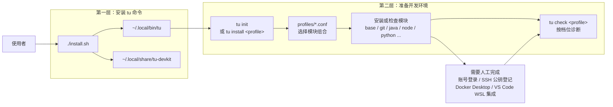
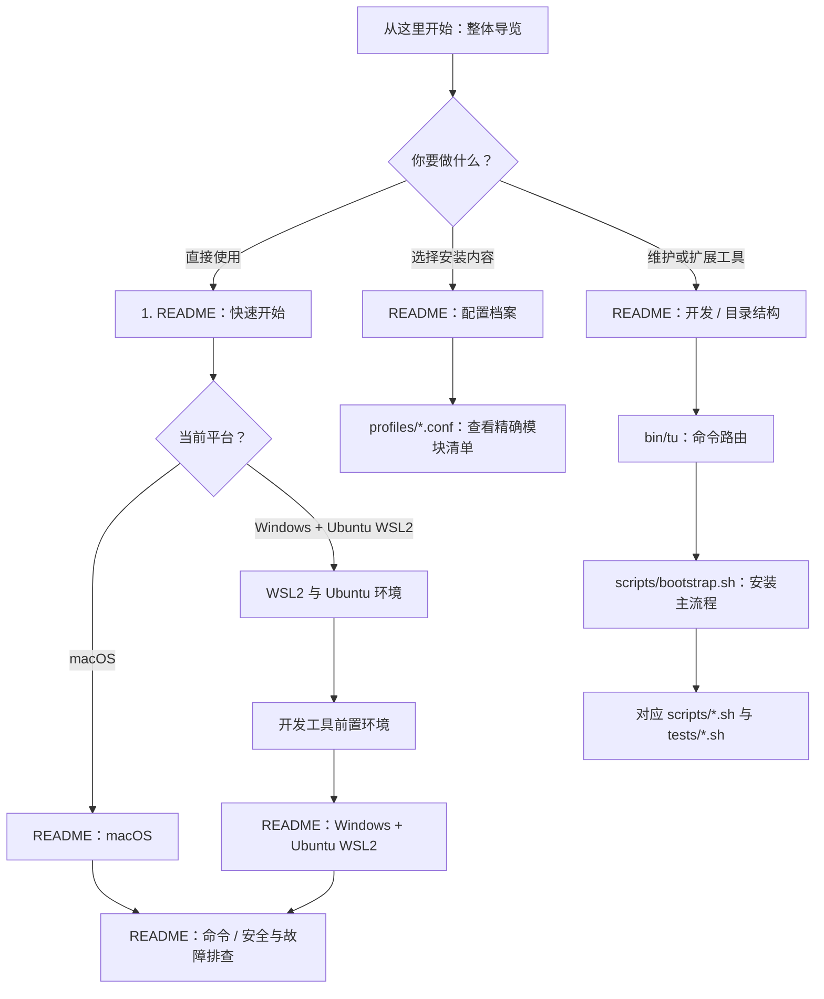
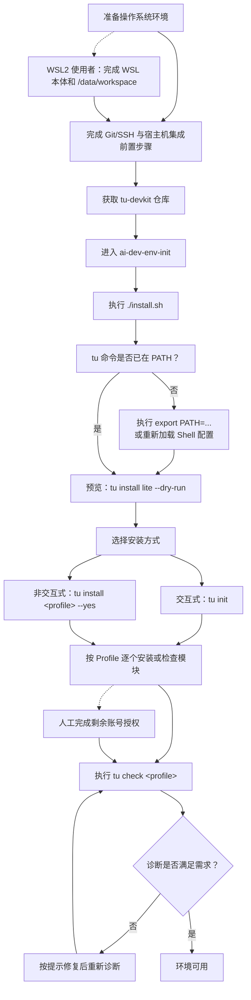
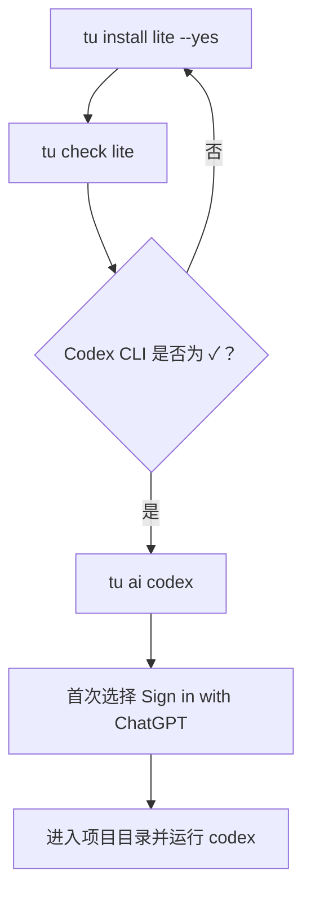
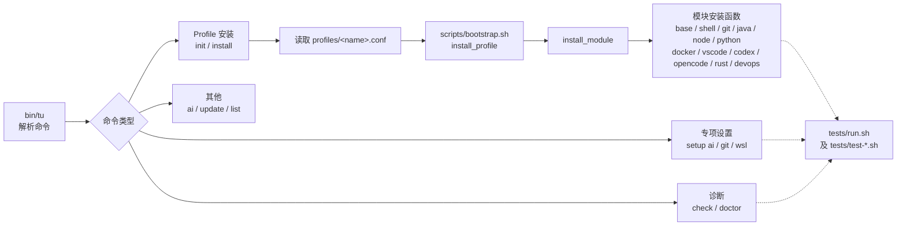
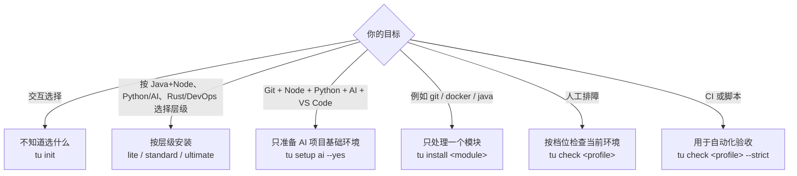

# ai-dev-env-init 整体导览

本文用来回答三个问题：

1. 第一次接触这个模块，应该先看什么？
2. 从安装 `tu` 到开发环境可用，完整流程是什么？
3. Profile、模块、脚本和诊断之间是什么关系？

如果只想使用工具，先看本文的“使用主流程”，再回到 [README](../README.md#快速开始) 按命令操作即可。

## 一图认识这个模块

`ai-dev-env-init` 分为两层：

- `./install.sh` 安装的是 **`tu` 命令本身**；
- `tu init` 或 `tu install <profile>` 才会按照 Profile 安装或检查 **开发工具链**。

工具会尽量跳过已经存在的命令，并在修改用户配置前进行提示或备份。账号授权、密钥上传和宿主机集成仍由使用者完成。

## 推荐阅读顺序

根据你的目标选择一条路径，不需要从头读完所有文件。

### 最短阅读路径

| 读者 | 建议顺序 | 读完能解决什么 |
| --- | --- | --- |
| 首次使用者 | 本文 → [README 快速开始](../README.md#快速开始) → [命令](../README.md#命令) | 安装 `tu`、选择 Profile、完成诊断 |
| WSL2 使用者 | 本文 → [WSL2 与 Ubuntu 环境](windows-wsl2-setup.md) → [开发工具前置环境](development-tools-prerequisites.md) → [README WSL2 部分](../README.md#windows-1110--ubuntu-wsl2) | 完成 WSL 本体、目录权限、Git/SSH、宿主机集成与 `tu` 初始化 |
| Profile 选择者 | [README 配置档案](../README.md#配置档案) → `profiles/*.conf` | 理解各 Profile 的用途和实际模块组合 |
| 模块维护者 | [README 开发](../README.md#开发) → `bin/tu` → `scripts/bootstrap.sh` → 对应测试 | 理解命令分发、Profile 展开、模块安装和验证入口 |

## 使用主流程

下面是一次完整的首次使用流程。虚线步骤表示需要按平台或个人状态决定是否执行。

推荐先执行 `--dry-run` 查看计划。日常 Java + Node + Codex 使用 `lite`；需要 Python/uv 与 OpenCode 时使用 `standard`；需要 Rust、DevOps 和 OpenRouter 登录入口时使用 `ultimate`。OpenRouter 的 API Key 仍由用户在 `tu ai openrouter` 启动的官方界面中输入。只准备 AI 项目基础环境时，可以使用 `tu setup ai --dry-run` 和 `tu setup ai --yes`。

## 首次开始 Codex 开发

不需要等待所有可选工具都安装完。首次安装被网络或 `Ctrl+C` 中断时，直接重复同一条所选档位命令即可；已完成的步骤会跳过或补全。

| 项目 | 对 Codex 首次开发是否阻塞 |
| --- | --- |
| Git、Node/npm/pnpm、Codex CLI | 阻塞：缺失时重跑 `tu install lite --yes`。 |
| Python/pip/uv、Java/Maven/Gradle | 仅相应语言项目需要。 |
| Docker daemon、VS Code Remote - WSL | 仅容器或 VS Code 图形工作流需要。 |
| GitHub CLI、lazygit、OpenCode | 可选；不阻塞 Codex。 |

`tu ai login` 会同时要求 Codex 与 OpenCode，因此只使用 Codex 时直接运行 `tu ai codex`。

### 缺失项的最小补救

安装中断后优先重跑当前所选 profile，例如 `tu install lite --yes`，然后重新执行对应的 `tu check lite`。`tu check lite`、`tu check standard`、`tu check ultimate` 分别按三档环境标出必需项；具体缺失补救命令统一在 [README](../README.md) 的“安装中断或 tu check 缺失时怎么办”部分维护。

## 命令内部流向

从维护者视角看，命令执行链路如下：

主要目录职责：

| 路径 | 职责 | 什么时候看 |
| --- | --- | --- |
| `install.sh` | 将运行包复制到用户目录并安装 `tu` wrapper | 修改工具自身安装方式时 |
| `bin/tu` | CLI 入口与子命令路由 | 新增或调整命令时 |
| `profiles/*.conf` | 声明一个 Profile 包含哪些模块 | 调整工具组合时 |
| `scripts/bootstrap.sh` | Profile 展开和各模块安装/检查逻辑 | 修改安装行为时 |
| `scripts/setup-*.sh` | AI、Git、WSL2 等专项初始化流程 | 修改专项设置时 |
| `scripts/doctor.sh` | 环境诊断 | 新增检查项或排障提示时 |
| `lib/*.sh` | 日志、平台识别和公共函数 | 修改跨脚本公共能力时 |
| `tests/*.sh` | 布局、命令、Profile、安装和诊断测试 | 每次行为变更后验证 |
| `modules/` | 模块化扩展的预留结构 | 规划后续模块拆分时 |

## 如何选择入口命令

无论选择哪种安装入口，都建议以 `tu check <profile>` 收尾；需要在所选档位必需 CLI 缺失时返回非零退出码，则使用 `tu check <profile> --strict`。
