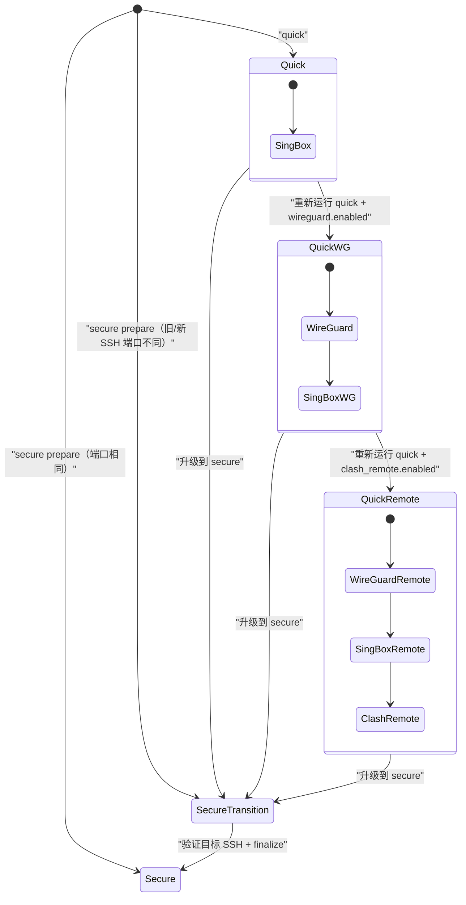
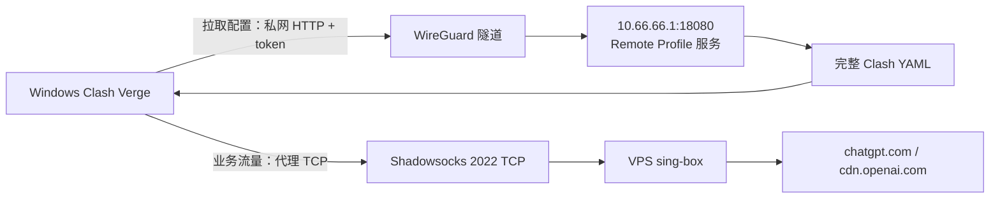

# VPS 网络架构

Quick 与 Secure 复用同一套阶段脚本；Profile 只负责选择阶段和安全门禁，不维护两份安装实现。

## 安装状态迁移

`profile` 表示 SSH 安全阶段；`capabilities` 单独记录 `sing-box`、`wireguard`、`clash-remote`，因此 Quick 的可选能力不会污染 Profile 语义。

## 客户端数据流

Remote 配置下载与 ChatGPT 业务流量是两条独立链路：

使用 `client_mode: management` 时，WG 只承载私网管理/订阅 CIDR；ChatGPT 业务仍通过 Clash 的 Shadowsocks TCP 节点。`full` 则让客户端全部 IP 流量进入 WG，保持旧行为。

## 入站边界

- Quick：当前 SSH TCP、sing-box TCP；可选 WG UDP。
- Secure 过渡：当前/目标 SSH TCP、WG UDP、sing-box TCP。
- Secure 完成：目标 SSH TCP、WG UDP、sing-box TCP。
- Remote：只允许 `in on wg0` 到 WG 服务端私网地址和配置端口，不增加公网入站。

sing-box 始终为 TCP-only。Clash 拒绝 UDP/443，使浏览器 QUIC 尝试立即失败并回落到 HTTP/2/TCP。
