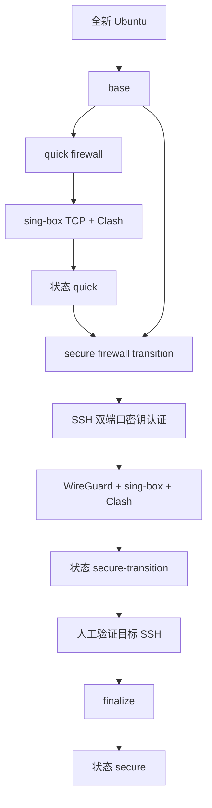

# VPS 网络架构

两条 Profile 复用同一套阶段脚本和配置，不维护两份安装实现。

Quick 的公网入站仅有当前 SSH TCP 与 sing-box TCP。Secure 过渡期额外开放目标 SSH TCP 和 WireGuard UDP；完成收口后公网 SSH 保留在目标端口并仅允许密钥认证。sing-box 始终为 TCP-only，Clash 拒绝 UDP/443 后回落 HTTP/2。
