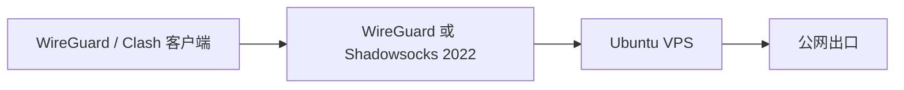

# VPS 网络架构

`vps-init` 只配置一台 VPS 的网络基础能力：UFW 和 Fail2ban 缩小公开攻击面，WireGuard 提供独立设备密钥的私有网络，sing-box 在显式启用后提供 Shadowsocks 2022 入站，Clash 文件只用于导入客户端。

开发者本机工具链仍由 `dev-env-init/` 维护；VPS 模块不读取其 Profile，也不由 `tu init` 自动调用。
