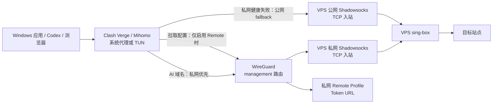

# WireGuard、sing-box 与 Clash Verge 联合架构与运维手册

## 1. 适用范围

本手册描述 P0-1 的个人 AI 开发代理链路：Windows 上的 Clash Verge 按规则选择代理，优先经 WireGuard 私网进入 VPS 上的 sing-box Shadowsocks 2022 入站；私网不可用时回退同一 sing-box 入站的公网地址。它不提供公共代理服务、VPS 购买方案、公开 Controller 或 Remote Profile 的公网发布方法。

所有示例均使用占位符或私网语义，不记录真实公网地址、端口、密钥、订阅 URL、运行 PID 或软件版本。具体部署参数始终以本机 `vps.local.yaml`、VPS 受保护状态文件和实机命令为准。

## 2. 架构与责任边界



| 层 | 负责什么 | 不负责什么 |
| --- | --- | --- |
| WireGuard | Windows 到 VPS 私网路由、端到端加密、私网订阅可达 | 域名规则、Shadowsocks 认证、自动 fallback |
| sing-box | 接收 Shadowsocks、VPS 出站、配置与服务校验 | Windows 系统代理、WireGuard Peer 生命周期 |
| Clash Verge / Mihomo | 应用流量接管、域名规则、私网优先与公网 fallback | VPS 服务端密钥、私网隧道身份 |
| `vps-init` | 受控生成配置、最小 UFW 规则、服务状态与回滚 | 云安全组、DNS、证书、供应商控制台 |

默认 `client_mode: management` 只把 WireGuard 私网 CIDR 送进隧道；它不会接管全机默认路由。`full` 会把全部 IPv4 流量导入 WireGuard，必须另外设计 DNS、IPv6、kill switch 和公网 fallback，不能仅把 `AllowedIPs` 改成 `/0`。

## 3. 初次部署与变更前检查

### 部署选择

| 目标 | 推荐路径 |
| --- | --- |
| 先验证公网代理 | Quick + 本地 Clash YAML |
| 私网优先、保留公网 fallback | Quick + WireGuard + 本地 YAML |
| 私网下载配置、减少敏感 YAML 分发 | Quick/Secure + WireGuard + Remote Profile |
| 新 VPS 完成常规 SSH 加固 | Secure + WireGuard；验证新 SSH 后再 Finalize |

路径的完整命令见 [VPS 初始化教程](../initialization-guide.md)。Remote Profile 是经 WireGuard 私网获取 YAML，不是 Clash 的远程控制接口。

### 变更前门禁

对 WireGuard、sing-box、UFW、SSH 或 Clash Profile 作任何变更前，至少确认：

1. 保持一个已登录的 VPS SSH 会话；涉及 SSH 或防火墙时，同时保留供应商 Console / Serial Console 恢复入口。
2. 记录当前生效 Profile、服务状态和可回滚的配置副本，但不把敏感内容写入聊天或 Git。
3. 先执行 `--dry-run`，核对 SSH、WireGuard、sing-box 与 Remote 端口是否符合预期。
4. 确认 Windows 端存在公网 fallback，且 AI 代理组不包含 `DIRECT`。
5. 不在一次变更中同时修改隧道路由、服务端密钥和客户端规则；出现异常时才能定位与回滚。

## 4. 正常运行时的验收

### VPS

在仓库的 `vps-init` 目录中运行：

```bash
./doctor.sh --config config/vps.local.yaml
sudo systemctl status wg-quick@wg0 sing-box --no-pager
sudo wg show wg0 latest-handshakes
sudo sing-box check -c /etc/sing-box/config.json
```

正常期望：`doctor.sh` 的 UFW、Fail2ban、sing-box 和配置检查通过；启用 WireGuard 时 `wg-quick@wg0` 正常且有近期握手；sing-box 正在监听预期 TCP 端口。Linux 上 `wg-quick@wg0` 可能显示 `active (exited)`，因为接口数据面在内核中，这不是异常。

### Windows

1. 在 WireGuard 客户端确认隧道已激活、适配器 Up，并只包含预期的 `AllowedIPs`。
2. 在 Clash Verge 确认正确 Profile 已启用，运行在 Rule 模式，AI 组有 `VPS-WireGuard` 与公网 fallback，且没有 `DIRECT`。
3. 若使用系统代理，确认 Windows 系统代理指向 Clash Verge 的本地 mixed port；若使用 TUN，确认排除了私网 CIDR 并启用严格路由。
4. 从仓库根目录运行：

```powershell
powershell -ExecutionPolicy Bypass -File .\vps-init\scripts\check-clash-runtime.ps1 -RequireWireGuard
```

检查器会核对 Mihomo 运行配置、WireGuard Tunnel Service、适配器及私网代理入口。Mihomo REST Controller 不可用时会退回读取合并配置；如果该文件受到 Windows ACL 保护，应使用有权限的交互式会话运行，不能把访问被拒绝误判为配置已通过。

## 5. 故障定位路径

按“离用户最近的层 → 服务端”的顺序排查，避免因服务器日志或配置文件存在就误判链路正常。

| 症状 | 先核对 | 下一步 |
| --- | --- | --- |
| 浏览器/Codex 没走代理 | Clash Verge 是否运行、本地 mixed port 是否监听、Windows 系统代理是否已启用 | 重新在 Clash Verge 保存系统代理；不要只临时写 WinINET 注册表 |
| 私网节点不可用，但公网节点可用 | Windows Tunnel Service、WireGuard 适配器、私网端口 TCP 可达性 | 查 `latest-handshakes`、Endpoint、UDP/UFW/云安全组和 `AllowedIPs` |
| WireGuard 已握手但私网代理端口不通 | VPS `wg0` 地址、sing-box 监听、主机 UFW | 运行 `doctor.sh` 和 `sing-box check`，再查 TCP 监听范围 |
| 两个节点都不可用 | Clash Profile、sing-box 服务、VPS 网络与防火墙 | 保持 SSH/Console 恢复路径，先恢复上一版服务端配置 |
| Remote Profile 无法刷新 | WireGuard 已连接、Remote 服务、仅 `wg0` 监听与 token URL | 不要为了刷新而开放公网 HTTP；断开 WG 时刷新失败是预期行为 |
| 长流式响应不稳 | 客户端 `smux` / `h2mux`、UDP/443 策略、连接健康检查 | 保持普通 Shadowsocks TCP；不要为了“加速”启用未验证 multiplex |

出现“配置文件正确但业务不通”时，优先使用实际链路证据：Windows 代理状态、本地监听、WireGuard 握手、私网 TCP 可达性以及 sing-box 服务检查。任一单独证据都不能证明端到端流量正确经过预期路径。

若 WireGuard GUI 已激活但没有近期握手或客户端 RX 始终为零，停止上层排查，按 [WireGuard 快速排查手册](wireguard-fast-troubleshooting.md) 对照 VPS 与 Windows 的同一轮 UDP 数据包。不要为验证基础隧道切换到全隧道或修改活动 Clash Profile。

若 WireGuard 已有近期握手和双向流量、私网 sing-box TCP 入口也可达，但 Clash Verge 主 Mihomo 中私网节点仍 Timeout，转入 [Clash Verge 私网节点快速排查手册](clash-verge-wireguard-private-node-troubleshooting.md)。先对比“隔离节点”和“主实例 TUN”运行态；只有隔离节点成功而主实例失败时，才核对设备级 `interface-name`，不要重新修改 Peer 或服务端认证。

## 6. 维护、升级与回滚

### 常规升级

1. 在维护窗口内更新受控仓库副本；先审阅变更，尤其是 `vps-init`、模板和防火墙规则。
2. 运行原有 Profile 的 `--dry-run`，确认不会改变不在本次范围内的端口和能力。
3. 在保留 SSH 会话和 Console 恢复入口的条件下运行原 Profile 安装命令。
4. 先验证 `sing-box check`、`doctor.sh`、WireGuard 握手，再刷新/导入新的 Clash Profile。
5. 在 Windows 上验证私网优先、公网 fallback 与恢复三个阶段，最后再结束维护窗口。

不要把“更新 sing-box”简化为直接升级单一 APT 包：P0-1 的生成配置、客户端模板和运行态规则必须一起验证。

### 回滚原则

| 变更对象 | 首选恢复 |
| --- | --- |
| sing-box 配置校验或重启失败 | 恢复脚本保存的上一版配置，再验证后重启服务 |
| Clash Profile 失效 | 切回已知可用的旧 Profile，再排查生成模板与客户端合并配置 |
| WireGuard 客户端更新失败 | 使用已安全保存的客户端配置重新导入或按官方服务流程重装隧道 |
| SSH / UFW 变更异常 | 保持旧 SSH 会话，通过供应商 Console 恢复；不要在失联状态继续叠加防火墙规则 |
| Remote token 疑似泄漏 | 视为凭据泄漏，轮换 token 并更新客户端订阅；不要仅删除聊天记录 |

脚本仅对其管理的配置与 UFW 注释规则承担所有权；不要用“重跑安装”当作清除所有既有服务器改动的手段。

## 7. 安全边界

- WireGuard 私钥、PresharedKey、Shadowsocks 密码、完整 Clash YAML 和 Remote URL/token 都是凭据；不得提交、截图、粘贴或写入常规日志。
- Remote Profile 只绑定 WireGuard 私网地址，防火墙规则仅允许 `in on wg0`；禁止为排错开放公网订阅端口。
- 不公开 Mihomo Controller、External UI 或服务端管理 API。
- UFW 启用前必须先确认当前 SSH、WireGuard UDP 与 Shadowsocks TCP 所需端口均存在受控允许规则；云安全组是独立边界，也要同步核对。
- 如果需要 IPv6 或全隧道，先做独立设计和验收，不可从默认 IPv4 分流方案推断安全性。

## 8. 关联手册

- [WireGuard 指南](wireguard.md)
- [WireGuard 快速排查手册](wireguard-fast-troubleshooting.md)
- [2026-08-22 WireGuard 连接故障复盘](../wireguard-connectivity-incident-2026-08-22.md)
- [Clash Verge 私网节点快速排查手册](clash-verge-wireguard-private-node-troubleshooting.md)
- [2026-08-22 Clash Verge 私网节点故障复盘](../clash-verge-wireguard-private-node-incident-2026-08-22.md)
- [sing-box 指南](sing-box.md)
- [VPS 网络架构](../architecture.md)
- [Remote Profile 教程](../clash-remote-profile.md)
- [VPS 安全说明](../security.md)
- [VPS 初始化教程](../initialization-guide.md)
