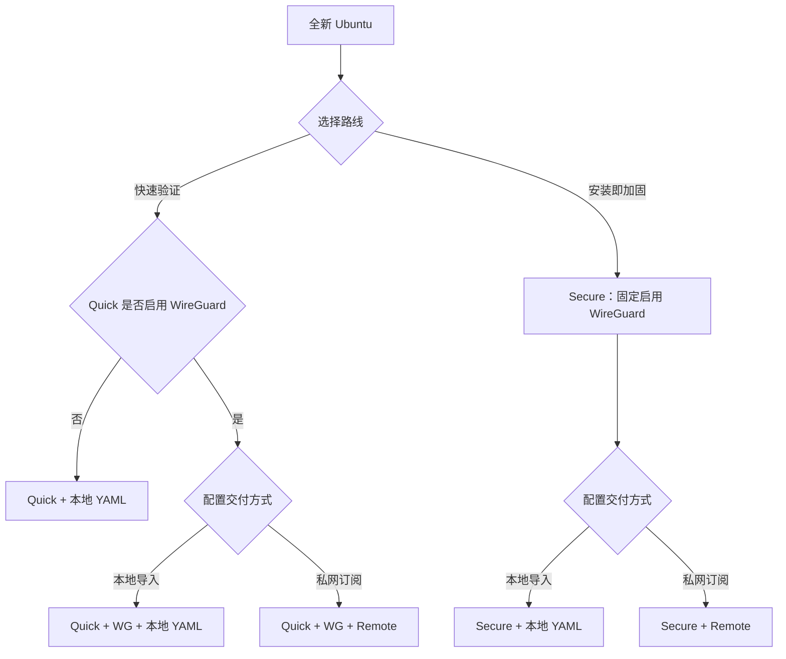

# VPS 初始化

`vps-init` 用同一套脚本提供两条安装路线，并支持两种 Clash 配置交付方式：

| 选择 | 适用场景 | SSH | WireGuard | Clash 配置 |
| --- | --- | --- | --- | --- |
| Quick | 先从 0 到 1 验证代理 | 保持供应商现状 | 默认关闭，可选 | 本地 YAML；开启 WG 后可选 Remote |
| Secure | 安装时完成常规安全加固 | 两阶段迁移到密钥认证 | 始终安装 | 本地 YAML；可选 Remote |

Remote Profile 是“经 WireGuard 私网拉取 Clash YAML”，不是 Clash 远程控制。第一版不会开放公网订阅端口、Clash Controller 或管理 UI。



## 1. 从全新 Ubuntu 开始

服务器上只需先手动安装 Git 与 CA 证书：

```bash
sudo apt-get update
sudo apt-get install -y ca-certificates git
git clone <your-tu-devkit-remote>
cd tu-devkit/vps-init
cp config/vps.example.yaml config/vps.local.yaml
```

编辑 `config/vps.local.yaml`。至少确认：

- `server.public_endpoint`：VPS 公网 IP 或域名，供 WireGuard 与 Clash 共用。
- `ssh.current_port`：供应商当前 SSH 监听端口，默认 `22`。
- `ssh.port`：Secure 完成后的 SSH 端口。
- `ssh.admin_authorized_keys_path`：Secure 使用的非 root 管理员公钥文件。
- `wireguard.enabled`：只控制 Quick 是否安装 WG；Secure 会忽略 `false` 并固定安装。
- `wireguard.client_mode`：默认 `management`，只路由 WG 私网 CIDR；显式使用 `full` 才生成 `AllowedIPs = 0.0.0.0/0`。
- `clash_remote.enabled`：是否启用 WG 私网 Remote Profile。

旧配置无需结构迁移；若旧文件省略 `wireguard.client_mode`，现在会按更安全的 `management` 处理。确实需要全隧道的旧环境应显式补上 `client_mode: full`。

```yaml
wireguard:
  enabled: false
  client_mode: management # management | full

clash_remote:
  enabled: false
  port: 18080
  update_interval_hours: 24
```

真实端点、密码、私钥、`vps.local.yaml`、`output/` 和 Remote URL/token 都不得提交到 Git 或复制到日志。

## 2. 四条常用路径

### A. Quick：本地 Clash YAML，不安装 WG

保持默认的 `wireguard.enabled: false`、`clash_remote.enabled: false`：

```bash
./install.sh --profile quick --config config/vps.local.yaml --dry-run
./install.sh --profile quick --config config/vps.local.yaml --yes
./doctor.sh --config config/vps.local.yaml
```

顺序：`base → firewall → sing-box → clash`。Quick 只放行当前 SSH TCP 与 sing-box TCP，并启用当前 SSH 端口的 Fail2ban；不修改 sshd、不迁移端口、不禁用密码认证。

将权限为 `600` 的 `output/vps-clash.yaml` 安全复制到本机，再导入 Clash Verge。

### B. Quick + WG：仍使用本地 Clash YAML

设置 `wireguard.enabled: true`、`clash_remote.enabled: false`，然后执行与路径 A 相同的 Quick 命令。顺序变为：

`base → firewall → wireguard → sing-box → clash`

生成客户端：

```bash
sudo ./scripts/wg-add-client.sh laptop
```

Windows 手工配置可从 [`config/wireguard-client.example.conf`](config/wireguard-client.example.conf) 复制到仓库外，只替换客户端私钥、服务端公钥、PresharedKey、VPS 公网地址和 WireGuard UDP 端口。模板固定保留 `AllowedIPs = 10.66.66.0/24`，且默认不设置 DNS/IPv6，避免再次触发全隧道 kill switch 或把 DNS 指向尚未验证的私网服务。`config/*.conf` 默认忽略，只有脱敏的 `*.example.conf` 允许提交。

`client_mode: full` 只适合明确希望客户端全量流量进入 WG 的情况；默认 `management` 用于访问私网订阅和 AI 私网入口，避免公网 fallback 也被 WG 默认路由包住。生成的 `🤖 AI Development` 组会优先使用 `VPS-WireGuard (10.66.66.1)`，私网探测失败时自动回退 `VPS-SantaClara` 公网入口。

Clash Profile 的 TUN 会在系统路由层排除 RFC 1918、CGNAT、链路本地、组播和 IPv6 本地网段；这与后续的私网 `DIRECT` 规则作用层次不同。前者保证局域网和 WG 私网不被 TUN 接管，后者保证这些流量进入 Mihomo 时仍不会选择代理节点。

### C. Quick + WG + Remote

```yaml
wireguard:
  enabled: true
  client_mode: management
clash_remote:
  enabled: true
```

执行 Quick 命令后，顺序为：

`base → firewall → wireguard → sing-box → clash → clash-remote`

连接 WireGuard 后，显式查看敏感订阅 URL：

```bash
sudo ./show-clash-remote-url.sh
```

在 Clash Verge 中新增 Remote Profile。URL 形如：

```text
http://10.66.66.1:18080/subscription/<random-token>/vps-clash.yaml
```

服务仅绑定 WG 服务端地址；UFW 只允许 `in on wg0`，不会为公网网卡开放 `18080/tcp`。完整操作见[Remote Profile 教程](../docs/vps/clash-remote-profile.md)。

### D. Secure + Remote

Secure 固定安装 WG，因此 `wireguard.enabled` 可保持旧值；只需开启 `clash_remote.enabled: true`。开始前确认供应商 Web/Serial Console 可用，并保留当前 SSH 会话：

```bash
./install.sh --profile secure --config config/vps.local.yaml --dry-run
./install.sh --profile secure --config config/vps.local.yaml --yes
./doctor.sh --config config/vps.local.yaml
```

Prepare 会保留旧/新 SSH 端口、切换到非 root 密钥认证、安装 WG/sing-box/Remote，并写入 `secure-transition`。在第二终端通过目标端口成功登录后才能收口：

```bash
./install.sh --profile secure --finalize --verified-ssh --config config/vps.local.yaml --yes
./doctor.sh --config config/vps.local.yaml
```

`--yes` 不能替代 `--verified-ssh`。Finalize 只删除状态中记录、由本模块创建的旧 SSH 过渡规则，不删除用户已有 UFW 规则。若当前端口等于目标端口，Prepare 会直接形成 `secure`。

## 3. 状态与诊断

安装状态位于 `/var/lib/tu-devkit-vps-init/`：

- `profile`：`quick`、`secure-transition` 或 `secure`。
- `capabilities`：已安装的 `sing-box`、`wireguard`、`clash-remote`；重复执行采用并集，不会把仍运行的能力误标为已卸载。
- `managed-ufw-rules`：脚本拥有的防火墙规则。
- `secrets/`：密码、Remote token/URL 等敏感状态，权限为 `600`。

`doctor.sh` 优先按 capability 验收；旧状态没有 capability 文件时会按原 Quick/Secure 行为兼容推断：

```bash
./doctor.sh --config config/vps.local.yaml
./doctor.sh --profile quick --config config/vps.local.yaml
```

Remote 检查包括 systemd 服务、私网监听、`wg0` UFW 规则、发布文件权限和脱敏 HTTP 健康检查。过渡状态会明确输出下一条 Finalize 命令。

## 4. Clash/Codex 稳定性验收

新生成的节点启用 TCP Keep Alive，但不启用客户端 `smux`。实测 Codex 的模型刷新、WebSocket 与长流式响应在 `h2mux` 下会共享底层连接，连接迁移时会一起重试；普通 Shadowsocks TCP 的稳定性更好。sing-box 入站保留 multiplex 兼容能力并固定 `padding: false`，同时允许普通非 multiplex 客户端。VPS 未配置 IPv6 默认路由时，服务端域名解析固定使用 `ipv4_only`，避免解析到 AAAA 后出现 `cannot assign requested address`。升级顺序如下：

1. 在 VPS 上更新仓库，先重新执行原 Quick/Secure 安装命令，再运行 `doctor.sh`。
2. 确认 sing-box 已重启且校验通过，再导入不含 `smux` 的新 Clash YAML。
3. 将 Clash Verge Rev 升级到计划使用的新版，连接 WireGuard（如已启用），再导入或刷新 Profile。
4. 运行本机核验工具，确认的是 Mihomo 合并后的实际运行值，而不只是 YAML 文本。

```powershell
powershell -ExecutionPolicy Bypass -File .\scripts\check-clash-runtime.ps1
```

检查器优先连接本机 `127.0.0.1:9097`。若新版 Clash Verge 仅开放命名管道而未开放 REST Controller，则自动回退读取合并后的 `clash-verge.yaml`，检查 Rule 模式、IPv6、`smux`、TUN 与 AI 组不含 `DIRECT`；静态回退不会读取或输出节点密码。若 Controller 可用，还会执行当前节点和公网回退节点的多次 ChatGPT 延迟探测。若 Controller 端口或 secret 不同：

```powershell
powershell -ExecutionPolicy Bypass -File .\scripts\check-clash-runtime.ps1 `
  -Controller http://127.0.0.1:9090 -PromptForSecret
```

`-PromptForSecret` 会用受保护的交互输入读取 Controller secret，不要把 secret 直接写入脚本、文档或命令历史。

Clash Verge 的应用级设置可能覆盖 Profile 里的 `mixed-port` / `ipv6` / `tun`，这正是之前只检查生成 YAML 仍会漏掉运行时偏差的原因。若依赖 TUN 接管 Codex，额外传入 `-RequireTun`；否则 TUN 关闭只会警告，但必须确认 Codex 能稳定跟随系统代理。

Windows 上开启 Clash Verge 的虚拟网卡后，应用级 TUN 配置还可能在 Profile/Merge 之后覆盖 `stack`、`strict-route` 和 `route-exclude-address`。因此不能只在订阅 YAML 中维护私网排除项：应在 Clash Verge 的全局 TUN 设置中同步 `mixed`、`strict-route: true` 与模板中的全部 `route-exclude-address`，随后用 `-RequireTun` 验证合并后的 `clash-verge.yaml`。

回滚时先切回旧 Clash Profile；服务端脚本在 sing-box 配置校验或重启失败时会恢复上一版。

## 5. 安全与兼容边界

- Shadowsocks 2022 保持 TCP-only，节点为 `udp: false`；Clash 在业务规则之前拒绝 UDP/443，使 QUIC 快速回落 HTTP/2/TCP。服务端入站保留 multiplex 兼容能力，当前 Codex 客户端使用普通 TCP，不启用 `smux`。
- Steam 商店/社区主页面继续走 `🎬 Entertainment`；`steamstatic.com` 等图片与前端 CDN 默认走 `🎮 Steam CDN → DIRECT`，可在 Clash Verge 中手动回退 VPS，避免大量小资源绕行美国节点。
- Remote 复用同一份完整 Clash 模板；本地 YAML 导入仍受支持，且不会被自动转换或覆盖。
- 只有显式运行 `show-clash-remote-url.sh` 才显示敏感 URL；安装日志不记录 URL/token。
- sing-box 从官方 SagerNet APT stable 仓库安装，并固定校验 GPG 指纹 `2C317FBD5D886B4E89BAE8DA6D9152172A2B2F0C`，不执行 `curl | sh`。
- `--phase` 仍作为高级兼容入口；`--profile` 与 `--phase` 互斥。未指定入口时只显示帮助，不修改服务器。
- 云厂商安全组、DNS、TLS 证书与 VPS 购买不由脚本修改。

## 6. 开发验证

```bash
bash vps-init/tests/run.sh
bash -n vps-init/*.sh vps-init/lib/*.sh vps-init/scripts/*.sh vps-init/tests/*.sh
shellcheck vps-init/*.sh vps-init/lib/*.sh vps-init/scripts/*.sh vps-init/tests/*.sh
```

真实 VPS 仍需分别验收 Quick、Quick+WG、Quick+WG+Remote 与 Secure+Remote。
