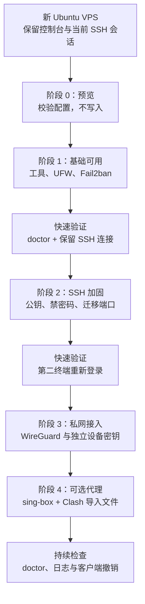

# VPS 网络环境初始化

`vps-init` 是 `tu-devkit` 的顶层独立模块：它把一台 Ubuntu 22.04+ VPS 逐步变成可管理的个人网络节点。它不属于 `dev-env-init`，不会被 `tu init` 或 `tu install <profile>` 自动调用。

本模块的原则是：**先可用、再可验证、最后加固**。不会把 SSH、VPN、代理和所有安全策略塞进一次不可逆的操作中。

## 先理解整个流程



### 为什么不把所有安全设置都前置？

安全不能完全后置：刚拿到 VPS 时就应该减少最明显的风险。但直接禁用 SSH 密码登录、切换端口、启用防火墙和 VPN，若一次失败会让你失去唯一管理入口。

因此采用两层策略：

| 层次 | 何时执行 | 内容 | 目的 |
| --- | --- | --- | --- |
| 最低安全底座 | 第一次执行 | 配置校验、管理员公钥前置检查、UFW 最小放行、Fail2ban | 在不切断现有 SSH 的前提下缩小攻击面。 |
| 高阶加固 | 完成快速验证后 | 禁用密码登录、禁用 root 登录、WireGuard、代理服务和客户端密钥管理 | 逐项改变访问方式；每项都能独立回滚和验证。 |

不要把安全完全延后到 VPS 已长期暴露在公网之后；也不要在没有控制台或第二 SSH 会话时执行 SSH 加固。

## 开始前：三件必须做的事

1. 在供应商控制台确认有可用的 Web/Serial Console，或至少保留当前 SSH 会话不关闭。
2. 为要继续管理服务器的账户准备 SSH 公钥，并写入对应的 `authorized_keys` 文件。
3. 从仓库复制配置示例；`vps.local.yaml`、输出客户端配置和秘密文件不会进入 Git。

```bash
cd vps-init
cp config/vps.example.yaml config/vps.local.yaml
```

> 不要把私钥、WireGuard 配置、sing-box 密码或真实服务器地址提交到仓库、粘贴到 Issue，或放进聊天记录。

## 阶段 0：预览计划（零副作用）

```bash
./install.sh --config config/vps.local.yaml --phase base,firewall --dry-run
```

它会做什么：读取并校验端口、CIDR、开关与协议组合，展示即将执行的基础阶段。

为什么做：先发现错误端口、冲突配置或不支持的系统，避免在 SSH 会话里边改边猜。

快速验证：命令应只输出 `[DRY-RUN]` 计划，不安装软件、不写入 `/etc`、不重启服务。

## 阶段 1：建立最低安全底座

```bash
./install.sh --config config/vps.local.yaml --phase base,firewall --yes
./doctor.sh --config config/vps.local.yaml
```

| 内容 | 做什么 | 为什么 | 快速验证 |
| --- | --- | --- | --- |
| `base` | 检查 Ubuntu/权限/网络，安装 `curl`、`git`、`ufw`、`fail2ban` 等基础工具 | 使后续阶段具备一致的管理与诊断能力 | 安装日志没有失败包；不会自动重启服务器。 |
| `firewall` | UFW 默认拒绝入站、允许出站；先放行配置中的 SSH 端口；启用 Fail2ban | 限制公网暴露面，同时保持管理入口 | `doctor.sh` 显示 UFW、SSH 端口与 Fail2ban 状态为 `OK`。 |

此阶段不会修改 SSH 的认证方式。确认原 SSH 会话仍可用后，再进入下一阶段。

## 阶段 2：SSH 高阶加固（最容易锁定自己的阶段）

先在第二个终端使用目标端口和公钥完成一次登录验证。仅当下面三项均满足时执行：

- 管理员公钥已经存在；默认检查 `ssh.admin_authorized_keys_path`。
- UFW 已放行目标 SSH 端口。
- 当前会话和第二终端/供应商控制台都可用。

```bash
./install.sh --config config/vps.local.yaml --phase ssh-hardening
```

它会做什么：备份本模块的 SSH 配置片段，写入候选配置，运行 `sshd -t`，校验成功才重载 SSH；重载失败会恢复该片段。

为什么做：禁用密码和空密码认证可降低暴力破解风险；`disable_root_login` 默认为 `true`，可避免直接 root 登录成为攻击入口。

快速验证：**不要关闭当前会话**。用第二终端重新连接，确认公钥登录成功，再验证密码登录已被拒绝。失败时使用保留的会话或供应商控制台恢复。

## 阶段 3：WireGuard 私有网络

在 `config/vps.local.yaml` 中设置 `wireguard.enabled: true`，并填写实际 `wireguard.endpoint`（供客户端连接的公开 IP 或域名）。

```bash
./install.sh --config config/vps.local.yaml --phase wireguard --yes
./wg-add-client.sh iphone
./doctor.sh --config config/vps.local.yaml
```

它会做什么：安装 WireGuard，生成权限受限的服务器密钥，建立 `wg0`、IPv4 转发/NAT 和独立客户端配置。每台设备有独立 key；新增 peer 会持久化，重启后不会丢失。

为什么做：设备可以经加密私网访问 VPS；独立 key 让设备遗失或不再使用时可以单独撤销，不影响其他设备。

快速验证：导入生成的客户端 `.conf` 后连接，执行 `wg show` 查看 handshake；`doctor.sh` 显示 `WireGuard wg0 active`。撤销设备使用：

```bash
./wg-remove-client.sh iphone
```

客户端配置含私钥，只能从受限本地目录导入，不能提交或分享。

## 阶段 4：可选 sing-box 与 Clash

该阶段默认关闭。只有明确需要 Shadowsocks 2022 代理入口时，才设置 `sing_box.enabled: true` 并执行：

```bash
./install.sh --config config/vps.local.yaml --phase sing-box --yes
SING_BOX_ENDPOINT='你的公开域名或IP' ./scripts/generate-clash-profile.sh
```

它会做什么：从已配置的 apt 源安装 `sing-box`，生成随机密码并写入权限受限的运行配置；确认配置有效后启用服务，并生成受限权限的 Clash YAML。

为什么做：这是额外公网暴露面，不应作为基础阶段的隐式默认行为；分开执行可让你先确认 WireGuard/SSH 管理路径正常。

当前生成的 Shadowsocks 2022 节点只开放 TCP，不开放 UDP。Clash 配置会在所有业务规则之前明确拒绝 UDP/443，使浏览器的 QUIC 请求立即失败并回落到 HTTP/2/TCP，避免请求继续匹配不支持 UDP 的节点后等待超时。该策略以稳定性为先，不提供 HTTP/3。

仓库中的模板和生成器更新不会覆盖 Clash Verge 中已经导入的配置。升级后必须重新运行 `generate-clash-profile.sh` 并重新导入生成的 YAML，或将模板中的 UDP/443 拒绝规则同步到现有配置，然后在 Clash Verge 中重新加载配置。不要把包含真实端点和密码的配置提交到仓库或粘贴到聊天记录。

快速验证：`doctor.sh` 显示 sing-box active，客户端导入生成 YAML 后验证连通性。密码不会回显，遗失时应通过受控本地秘密文件轮换，而不是从日志中找回。

## 持续检查、日志与恢复

```bash
./doctor.sh --config config/vps.local.yaml
```

`doctor.sh` 只读检查 UFW、Fail2ban、SSH 端口和已启用服务。非 dry-run 的执行日志会写入 `/var/log/tu-devkit-vps-init/`；分享前必须人工复核与脱敏。

SSH 阶段的备份位于 `/var/lib/tu-devkit-vps-init/backups/ssh/`。若发生意外，优先使用仍保持连接的会话或供应商控制台处理，**不要**在无法访问服务器时继续叠加执行新的网络变更。

## 配置参考

从 [`config/vps.example.yaml`](config/vps.example.yaml) 开始。常用项如下：

| 配置项 | 默认值 | 说明 |
| --- | --- | --- |
| `ssh.port` | `22222` | SSH 管理端口；必须先经 UFW 放行。 |
| `ssh.disable_root_login` | `true` | 是否完全禁用 root 登录。 |
| `wireguard.enabled` | `false` | 显式启用 WireGuard。 |
| `wireguard.port` | `60273` | WireGuard UDP 监听端口。 |
| `wireguard.ipv4_cidr` | `10.66.66.0/24` | 私网地址池；如与已有网络冲突必须改动。 |
| `sing_box.enabled` | `false` | 显式启用 sing-box。 |
| `sing_box.port` | `8080` | sing-box TCP 监听端口。 |

## 开发验证

```bash
bash vps-init/tests/run.sh
bash -n vps-init/install.sh vps-init/doctor.sh vps-init/wg-add-client.sh vps-init/wg-remove-client.sh vps-init/lib/*.sh vps-init/scripts/*.sh vps-init/tests/*.sh
```

真实公网 VPS 的 SSH/UFW/WireGuard/sing-box 验收必须在一次性测试主机完成；本仓库的自动化测试不替代该验证。
